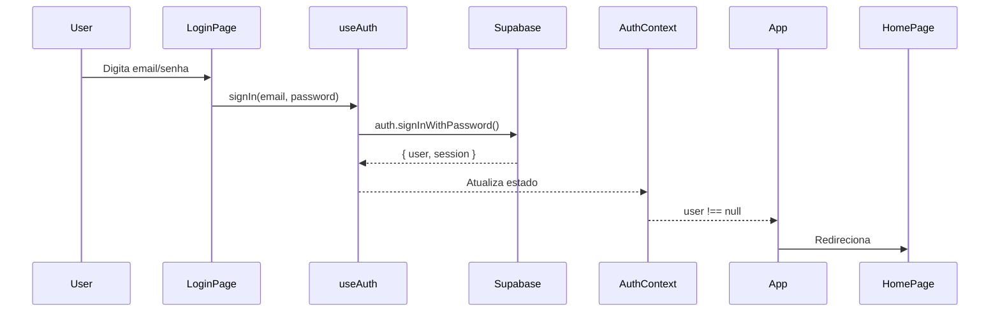
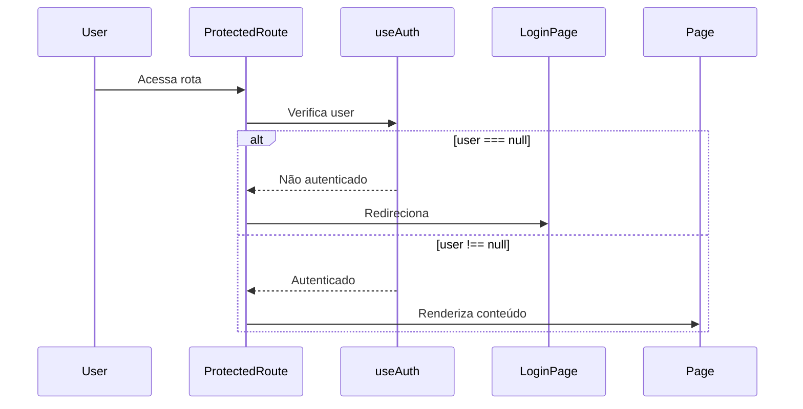
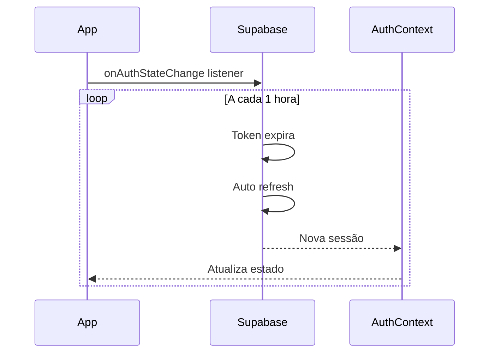

# 🔐 Autenticação ICARUS v5.0

## Visão Geral

O ICARUS v5.0 utiliza **Supabase Auth** para gerenciamento completo de autenticação e autorização. Este documento descreve a arquitetura, implementação e uso do sistema de autenticação.

---

## 📋 Índice

1. [Arquitetura](#arquitetura)
2. [Configuração Inicial](#configuração-inicial)
3. [Componentes](#componentes)
4. [Fluxo de Autenticação](#fluxo-de-autenticação)
5. [Proteção de Rotas](#proteção-de-rotas)
6. [RLS Policies](#rls-policies)
7. [Como Usar](#como-usar)
8. [Troubleshooting](#troubleshooting)

---

## 🏗️ Arquitetura

### Stack de Autenticação

```
┌─────────────────────────────────────────┐
│         Supabase Auth (Backend)         │
│   - Email/Password Authentication       │
│   - Session Management                  │
│   - Token Refresh                       │
│   - Password Reset                      │
└──────────────────┬──────────────────────┘
                   │
┌──────────────────▼──────────────────────┐
│         AuthContext (React)             │
│   - Global Auth State                   │
│   - User & Session Management           │
│   - Auth State Listeners                │
└──────────────────┬──────────────────────┘
                   │
┌──────────────────▼──────────────────────┐
│         useAuth Hook                    │
│   - signIn()                            │
│   - signUp()                            │
│   - signOut()                           │
│   - resetPassword()                     │
└──────────────────┬──────────────────────┘
                   │
┌──────────────────▼──────────────────────┐
│         Components                      │
│   - ProtectedRoute                      │
│   - Login Page                          │
│   - Header                              │
└─────────────────────────────────────────┘
```

### Componentes Principais

| Componente | Localização | Responsabilidade |
|------------|-------------|------------------|
| **AuthContext** | `src/contexts/AuthContext.tsx` | Provedor global de estado de auth |
| **useAuth Hook** | `src/contexts/AuthContext.tsx` | Hook para acessar funções de auth |
| **ProtectedRoute** | `src/components/auth/ProtectedRoute.tsx` | Guard para rotas autenticadas |
| **Login Page** | `src/app/(public)/login/page.tsx` | Interface de login/cadastro |
| **Header** | `src/components/layouts/Header.tsx` | Exibe usuário e logout |
| **Providers** | `src/components/providers/Providers.tsx` | Wrapper de contexts |

---

## ⚙️ Configuração Inicial

### 1. Variáveis de Ambiente

Crie ou atualize `.env.local`:

```env
# Supabase
NEXT_PUBLIC_SUPABASE_URL=https://seu-projeto.supabase.co
NEXT_PUBLIC_SUPABASE_ANON_KEY=sua-chave-anonima
```

### 2. Supabase Dashboard

1. Acesse [app.supabase.com](https://app.supabase.com)
2. Navegue até **Authentication > Providers**
3. Habilite **Email Provider**
4. Configure opções:
   - ✅ Enable Email Signup
   - ✅ Confirm Email (opcional, para produção)
   - ✅ Secure Email Change (recomendado)

### 3. Executar Schema SQL

Aplique as RLS policies executando `supabase/schema.sql`:

```bash
# Via Supabase Dashboard
# SQL Editor > New Query > Cole o conteúdo de schema.sql > Run

# Ou via CLI
supabase db push
```

---

## 🧩 Componentes

### AuthContext

**Arquivo**: `src/contexts/AuthContext.tsx`

Provê estado global de autenticação para toda a aplicação.

#### Interface

```typescript
interface AuthContextType {
  user: User | null                    // Usuário atual ou null
  session: Session | null              // Sessão ativa ou null
  loading: boolean                     // Estado de carregamento
  signIn: (email: string, password: string) => Promise<void>
  signUp: (email: string, password: string, metadata?: Record<string, any>) => Promise<void>
  signOut: () => Promise<void>
  resetPassword: (email: string) => Promise<void>
}
```

#### Funcionalidades

- **Session Persistence**: Mantém sessão entre reloads
- **Auto Refresh**: Atualiza tokens automaticamente
- **Real-time Sync**: Sincroniza estado em múltiplas abas
- **Error Handling**: Tratamento robusto de erros

### useAuth Hook

Hook personalizado para acessar contexto de autenticação.

#### Exemplo de Uso

```typescript
import { useAuth } from '@/contexts/AuthContext'

function MyComponent() {
  const { user, signOut, loading } = useAuth()

  if (loading) return <Loading />

  if (!user) {
    return <p>Não autenticado</p>
  }

  return (
    <div>
      <p>Olá, {user.email}</p>
      <button onClick={signOut}>Sair</button>
    </div>
  )
}
```

### ProtectedRoute

Componente para proteger rotas que requerem autenticação.

**Arquivo**: `src/components/auth/ProtectedRoute.tsx`

#### Comportamento

1. Exibe loading enquanto verifica autenticação
2. Redireciona para `/login` se não autenticado
3. Renderiza children se autenticado

#### Exemplo de Uso

```typescript
import { ProtectedRoute } from '@/components/auth/ProtectedRoute'

export default function ProdutosPage() {
  return (
    <ProtectedRoute>
      <div>
        {/* Conteúdo protegido aqui */}
      </div>
    </ProtectedRoute>
  )
}
```

### Login Page

Interface completa de autenticação com 3 modos:

**Arquivo**: `src/app/(public)/login/page.tsx`

#### Modos

1. **Login**: Email + senha
2. **Sign Up**: Criar nova conta
3. **Reset Password**: Recuperar senha

#### Features

- Validação com Zod
- React Hook Form
- Feedback de erros
- Design neumórfico (Dark Glass Medical)
- Loading states
- Tab navigation

#### Exemplo de Validação

```typescript
const loginSchema = z.object({
  email: z.string().email('Email inválido'),
  password: z.string().min(6, 'Mínimo 6 caracteres'),
})
```

### Header Component

Exibe informações do usuário e botão de logout.

**Arquivo**: `src/components/layouts/Header.tsx`

#### Features

- Exibe email do usuário
- Botão de logout
- Design neumórfico
- Sticky header
- Responsivo

---

## 🔄 Fluxo de Autenticação

### 1. Login Flow



### 2. Protected Route Flow



### 3. Session Refresh Flow



---

## 🛡️ Proteção de Rotas

### Rotas Públicas

Localizadas em `src/app/(public)/`:

```
/login         # Autenticação
/signup        # Cadastro (se separado)
/reset         # Reset de senha (se separado)
```

### Rotas Protegidas

Todas as outras rotas devem usar `<ProtectedRoute>`:

```typescript
// src/app/page.tsx
export default function HomePage() {
  return (
    <ProtectedRoute>
      <div className="min-h-screen bg-[#0f1419]">
        <Header />
        {/* Conteúdo protegido */}
      </div>
    </ProtectedRoute>
  )
}

// src/modules/estoque/produtos/page.tsx
export default function ProdutosPage() {
  return (
    <ProtectedRoute>
      <div className="min-h-screen bg-[#0f1419]">
        <Header />
        {/* Conteúdo protegido */}
      </div>
    </ProtectedRoute>
  )
}
```

### Layout Pattern

Para evitar duplicação, você pode criar um layout protegido:

```typescript
// src/app/(authenticated)/layout.tsx
import { ProtectedRoute } from '@/components/auth/ProtectedRoute'
import { Header } from '@/components/layouts/Header'

export default function AuthenticatedLayout({ children }) {
  return (
    <ProtectedRoute>
      <div className="min-h-screen bg-[#0f1419]">
        <Header />
        <main>{children}</main>
      </div>
    </ProtectedRoute>
  )
}
```

---

## 🔒 RLS Policies

### Row Level Security

Todas as tabelas têm RLS habilitado:

```sql
ALTER TABLE products ENABLE ROW LEVEL SECURITY;
ALTER TABLE categories ENABLE ROW LEVEL SECURITY;
```

### Policies Implementadas

#### Categories

| Operação | Policy | Condição |
|----------|--------|----------|
| SELECT   | Authenticated users can view categories | `auth.role() = 'authenticated'` |
| INSERT   | Authenticated users can insert categories | `auth.role() = 'authenticated'` |
| UPDATE   | Authenticated users can update categories | `auth.role() = 'authenticated'` |
| DELETE   | Authenticated users can delete categories | `auth.role() = 'authenticated'` |

#### Products

| Operação | Policy | Condição |
|----------|--------|----------|
| SELECT   | Authenticated users can view products | `auth.role() = 'authenticated'` |
| INSERT   | Authenticated users can insert products | `auth.role() = 'authenticated'` |
| UPDATE   | Authenticated users can update products | `auth.role() = 'authenticated'` |
| DELETE   | Authenticated users can delete products | `auth.role() = 'authenticated'` |

### Policies Avançadas (Futuro)

Para multi-tenancy ou permissões granulares:

```sql
-- Exemplo: Apenas o criador pode editar
CREATE POLICY "Users can update their own products"
  ON products FOR UPDATE
  USING (auth.uid() = created_by)
  WITH CHECK (auth.uid() = created_by);

-- Exemplo: Por tenant/empresa
CREATE POLICY "Users can view products from their company"
  ON products FOR SELECT
  USING (company_id = auth.jwt()->>'company_id');
```

---

## 💡 Como Usar

### 1. Criar Primeiro Usuário

```typescript
// Via Login Page (http://localhost:3000/login)
// 1. Clique na aba "Cadastro"
// 2. Digite email e senha
// 3. Clique em "Criar conta"

// Ou via código
const { signUp } = useAuth()
await signUp('admin@icarus.com', 'senha123')
```

### 2. Fazer Login

```typescript
// Via Login Page
// 1. Digite email e senha
// 2. Clique em "Entrar"

// Ou via código
const { signIn } = useAuth()
await signIn('admin@icarus.com', 'senha123')
```

### 3. Acessar Dados do Usuário

```typescript
const { user, session } = useAuth()

console.log(user.id)           // UUID do usuário
console.log(user.email)        // Email
console.log(user.user_metadata) // Metadados customizados
console.log(session.access_token) // JWT token
```

### 4. Verificar Autenticação em Componente

```typescript
function MyComponent() {
  const { user, loading } = useAuth()

  if (loading) {
    return <Loading text="Verificando autenticação..." />
  }

  if (!user) {
    return <p>Você precisa fazer login</p>
  }

  return <p>Olá, {user.email}!</p>
}
```

### 5. Logout

```typescript
const { signOut } = useAuth()

const handleLogout = async () => {
  await signOut()
  // Usuário será redirecionado para /login automaticamente
}
```

### 6. Reset de Senha

```typescript
// Via Login Page
// 1. Clique em "Esqueceu a senha?"
// 2. Digite email
// 3. Clique em "Enviar link"

// Ou via código
const { resetPassword } = useAuth()
await resetPassword('admin@icarus.com')
```

---

## 🐛 Troubleshooting

### Erro: "Invalid JWT"

**Causa**: Token expirado ou inválido

**Solução**:
```typescript
// Logout e login novamente
await signOut()
await signIn(email, password)
```

### Erro: "Row Level Security: new row violates policy"

**Causa**: RLS policy impedindo operação

**Solução**:
1. Verifique se usuário está autenticado
2. Confira policies no Supabase Dashboard
3. Execute `schema.sql` novamente se necessário

### Erro: "Failed to fetch"

**Causa**: Supabase não configurado ou offline

**Solução**:
1. Verifique `.env.local`
2. Confirme URL e Anon Key corretos
3. Teste conexão no Supabase Dashboard

### Sessão Expira Rapidamente

**Causa**: Configuração de timeout

**Solução**:
```typescript
// Supabase Dashboard > Authentication > Settings
// JWT Expiry: 3600 (1 hora padrão)
// Refresh Token Expiry: 2592000 (30 dias padrão)
```

### Redirecionamento não Funciona

**Causa**: ProtectedRoute não implementado

**Solução**:
```typescript
// Envolver página com ProtectedRoute
export default function MyPage() {
  return (
    <ProtectedRoute>
      {/* conteúdo */}
    </ProtectedRoute>
  )
}
```

### Email de Confirmação não Chega

**Causa**: Email provider não configurado

**Solução**:
1. Supabase Dashboard > Authentication > Email Templates
2. Configure SMTP customizado (produção) ou use Supabase (dev)
3. Para dev: desabilite "Confirm Email" temporariamente

---

## 📚 Referências

- [Supabase Auth Docs](https://supabase.com/docs/guides/auth)
- [Next.js App Router](https://nextjs.org/docs/app)
- [React Context](https://react.dev/reference/react/useContext)
- [ICARUS CLAUDE.md](../CLAUDE.md)
- [ICARUS .clinerules](../.clinerules)

---

## ✅ Checklist de Implementação

Ao adicionar autenticação em uma nova página/módulo:

- [ ] Importar `ProtectedRoute` e `Header`
- [ ] Envolver return em `<ProtectedRoute>`
- [ ] Adicionar `<Header />` no topo do conteúdo
- [ ] Verificar se `.env.local` está configurado
- [ ] Testar logout e login
- [ ] Verificar RLS policies no Supabase
- [ ] Tratar loading e error states
- [ ] Testar em múltiplas abas (session sync)

---

**Versão**: 1.0.0
**Data**: 2025-11-16
**Autor**: ICARUS Development Team

🔐 **Autenticação completa e segura com Supabase Auth!**
